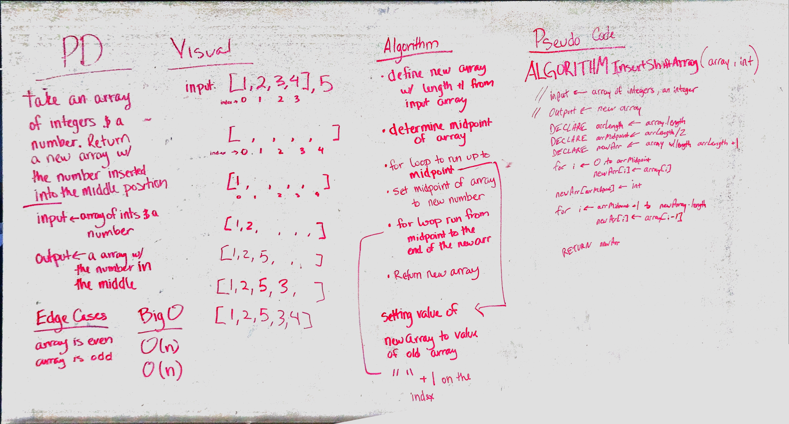

# Insert and shift middle index of array
<!-- Short summary or background information -->
Collaborated with Clarice Costello

## Challenge
<!-- Description of the challenge -->
Write a function called `ArrayShift` which takes in an array and the value to be added. Without utilizing any of the built-in methods available to your language, return an array with the new value added at the middle index.

## Approach & Efficiency
<!-- What approach did you take? Why? What is the Big O space/time for this approach? -->
Big O Time = O(n) // Big O Space = O(n)

To approach this challenge, we made a new array one index longer than the input array.
After determining the midpoint of the input array, we use two for loops to iterate through
both halves of the new array, inserting the original values before and after the new value.

## Solution
<!-- Embedded whiteboard image -->
