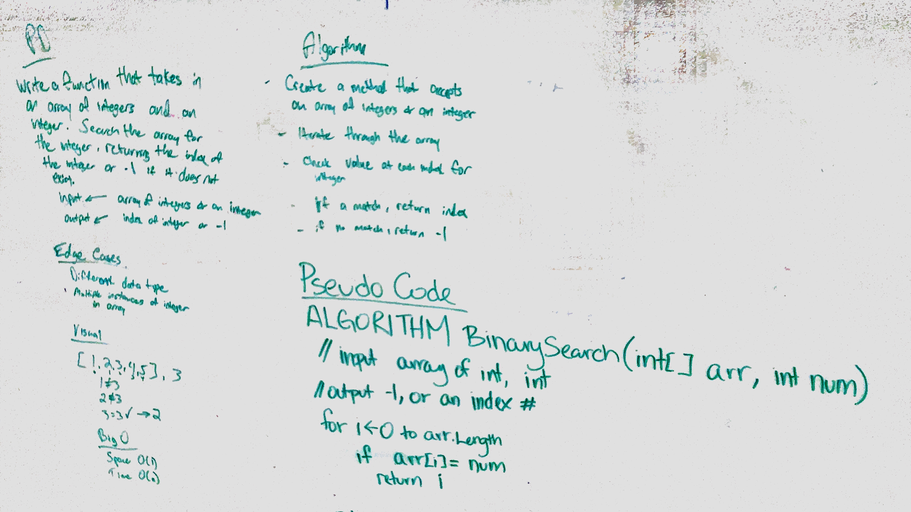

# Insert and shift middle index of array
<!-- Short summary or background information -->
Collaborated with Clarice Costello

## Challenge
<!-- Description of the challenge -->
Write a function called `BinarySearch` which takes in 2 parameters: a sorted array and the search key. Without utilizing any of the built-in methods available to your language, return the index of the array’s element that is equal to the search key, or -1 if the element does not exist.

## Approach & Efficiency
<!-- What approach did you take? Why? What is the Big O space/time for this approach? -->
Big O Time = O(log n) // Big O Space = O(1)

To approach this challenge, we created a function to accept a sorted array and a search key. The function calculates the min and max indices of the array and moves into a while loop to calculate the midpoint index of the array and compare the key to the value at that index. If the key is less than the value, the max is reset to mid-1 and the loop restarts. If the key is greater than the value, the min is reset to mid+1 and the loop restarts. The process is repeated, "halving" the remaining sections of the array until the value is found. If it is not found, the function returns -1.

## Solution
<!-- Embedded whiteboard image -->

