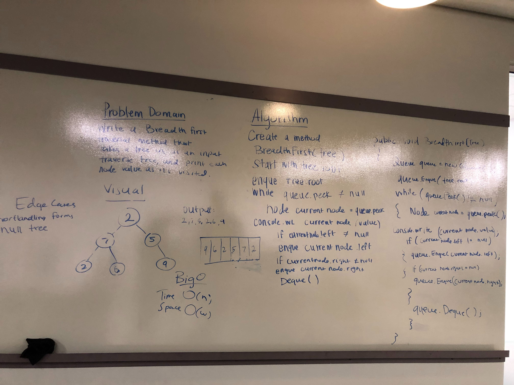

# Breadth-First
<!-- Short summary or background information -->
Breadth-first Traversal of a Binary Tree

## Challenge
<!-- Description of the challenge -->
Write a `BreadthFirstTraversal` method which takes a Binary Tree as its unique input. Without utilizing any of the built-in methods available to your language, traverse the input tree using a Breadth-first approach; print every visited node’s value.

## Approach & Efficiency
<!-- What approach did you take? Why? What is the Big O space/time for this approach? -->
The Root of the tree is enqueued into a queue. Upon dequeue, the left and right children (if they exist) are enqueued. Each value is outputted, and if children exist they are enqueued. This process continues until all leaves have been reached.
#### Big O
Time: O(1)
Space: O(1)

## Solution
<!-- Embedded whiteboard image -->
