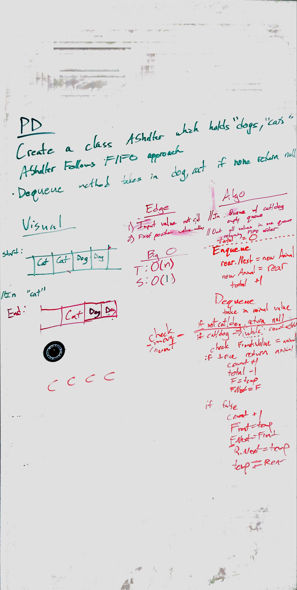

# First-in, First out Animal Shelter.
<!-- Short summary or background information -->
Create a first-in, first-out animal shelter for dogs and cats

## Challenge
<!-- Description of the challenge -->
Create a class called `AnimalShelter` which holds only dogs and cats. The shelter operates using a first-in, first-out approach.

Implement the following methods:
* `enqueue(animal)`: adds animal to the shelter. animal can be either a dog or a cat object.
* `dequeue(pref)`: returns either a dog or a cat. If pref is not "dog" or "cat" then return null.

Stretch Goal

If a cat or dog isn’t preferred, return whichever animal has been waiting in the shelter the longest.

## Approach & Efficiency
<!-- What approach did you take? Why? What is the Big O space/time for this approach? -->
To `Eneueue()` an animal, a check is performed to make sure it is a dog or cat. If so, the animal is added to the shelter into a queue.

To `Dequeue()` an animal, the queue is searched for the preferred animal. If `"Dog"`, `"Cat"`, or `""` (no preference) is not entered, the method returns null. The front animal in the queue is removed and checked for a match. If an immediate match is found, or there was no preference, the animal is returned. If no match is found, the animal is added back to the end of the queue and the next animal is removed and checked. When a match is found in the middle of the queue, the matching animal is stored while the rest of the queue is "carouseled" through the queue until the first animal is back in the front. The matching animal is then returned.

## Solution
<!-- Embedded whiteboard image -->
