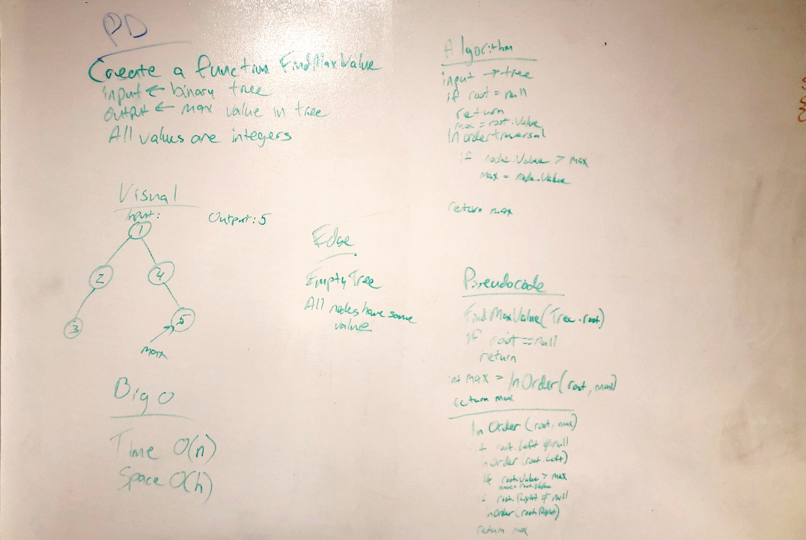

# Find the Maximum Value in a Binary Tree
<!-- Short summary or background information -->
Find the Maximum Value in a Binary Tree

## Challenge
<!-- Description of the challenge -->
Write a function called `FindMaximumValue` which takes binary tree as its only input. Without utilizing any of the built-in methods available to your language, return the maximum value stored in the tree. You can assume that the values stored in the Binary Tree will be numeric.

## Approach & Efficiency
<!-- What approach did you take? Why? What is the Big O space/time for this approach? -->

## Solution
<!-- Embedded whiteboard image -->
