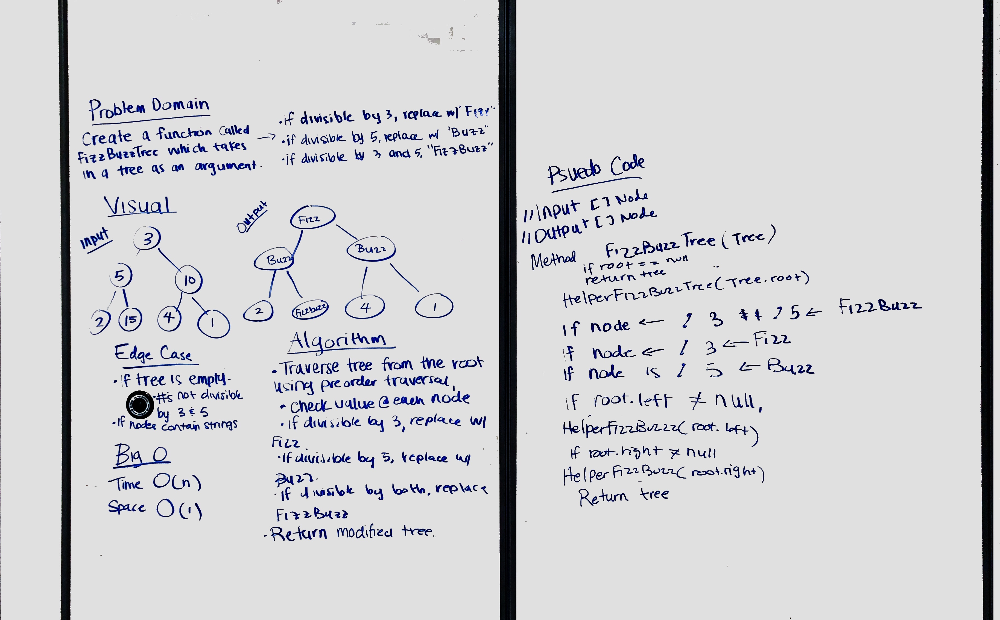

# FizzBuzz Tree
<!-- Short summary or background information -->
Conduct “FizzBuzz” on a tree while traversing through it. Change the values of each of the nodes dependent on the current node’s value

## Challenge
<!-- Description of the challenge -->
Write a function called `FizzBuzzTree` which takes a tree as an argument.
Without utilizing any of the built-in methods available to your language, determine weather or not the value of each node is divisible by 3, 5 or both, and change the value of each of the nodes:
* If the value is divisible by 3, replace the value with “Fizz”
* If the value is divisible by 5, replace the value with “Buzz”
* If the value is divisible by 3 and 5, replace the value with “FizzBuzz”

Return the tree with its new values.

## Approach & Efficiency
<!-- What approach did you take? Why? What is the Big O space/time for this approach? -->
#### Approach
The method `FizzBuzzTree` takes in a binary tree by its `Root` node. The tree is then traversed with an `InOrder` recursive traversal. Each node value is checked if it is divisible by 3, 5, or 3 & 5, and its value is changed appropriately. When all nodes have been checked, the tree is returned with the new values.
#### Big O
Time: O(n)
Space: O(h)

## Solution
<!-- Embedded whiteboard image -->
