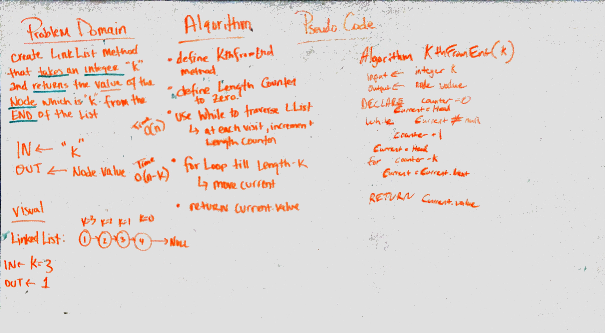

# Linked List Kth From End
<!-- Short summary or background information -->
Find the k-th value from the end of a linked list

## Challenge
<!-- Description of the challenge -->
Write a method for the Linked List class which takes a number, `k`, as a parameter. Return the node’s value that is `k` from the end of the linked list. You have access to the Node class and all the properties on the Linked List class as well as the methods created in previous challenges.

## Approach & Efficiency
<!-- What approach did you take? Why? What is the Big O space/time for this approach? -->
To approach this challenge, we created a method called `KthFromEnd`. In this method, we first iterate through the linked list to determine the length of the list. If k is larger than the length of the list or the list is null, an exception is thrown. If everything is valid, the method returns the node value at `k` from the end of the list.

Time O(n)
Space O(1)

## Solution
<!-- Embedded whiteboard image -->
