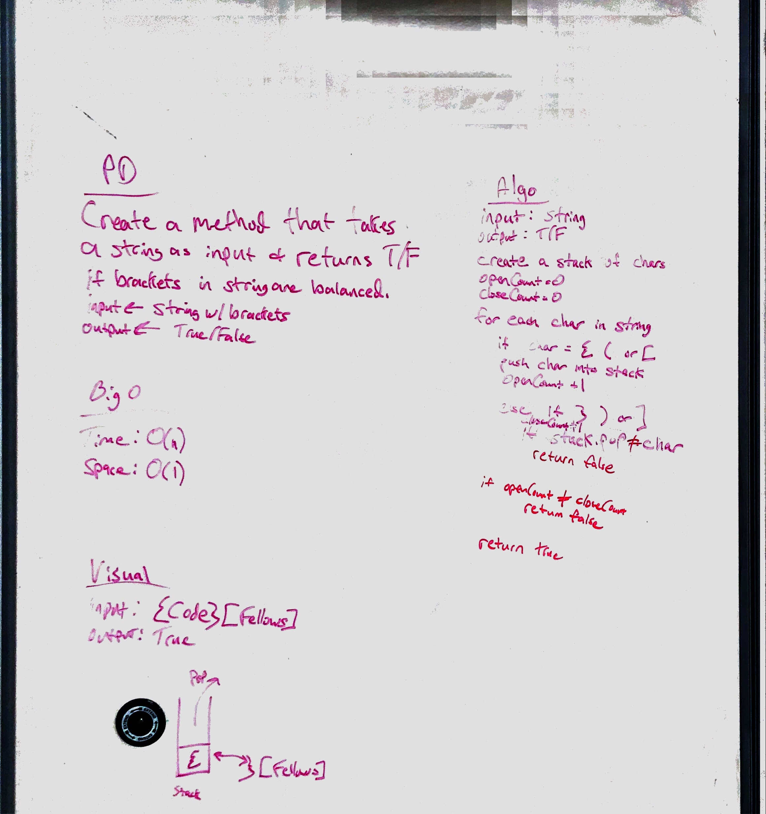

# Multi-bracket Validation.
<!-- Short summary or background information -->
A challenge to determine if a string containing brackets is "balanced" -- Collaborated with Kent Ketter

## Challenge
<!-- Description of the challenge -->
Your function should take a string as its only argument, and should return a boolean representing whether or not the brackets in the string are balanced. There are 3 types of brackets:

* Round Brackets : `()`
* Square Brackets : `[]`
* Curly Brackets : `{}`

## Approach & Efficiency
<!-- What approach did you take? Why? What is the Big O space/time for this approach? -->
To solve this challenge, we decided to iterate through each character in the input array. When a `({[` is found, it is pushed into a stack. Further `({[` are pushed into the stack. When a `)}]` is found, a check is performed to see if it matches the bracket on top of the stack. If there is a match, the stack is popped. If there is no match, or the stack is not empty at the end of the string iteration, then the brackets are determined to be unbalanced and a `false` is returned. If at the end of the string iteration completes, and the stack is empty, then the brackets are balanced and `true` is returned.

### Big O
Time: O(n)
Space: O(1)

## Solution
<!-- Embedded whiteboard image -->

(Note: Office Lens cut off the Pseudocode section and was not noticed until we left campus)