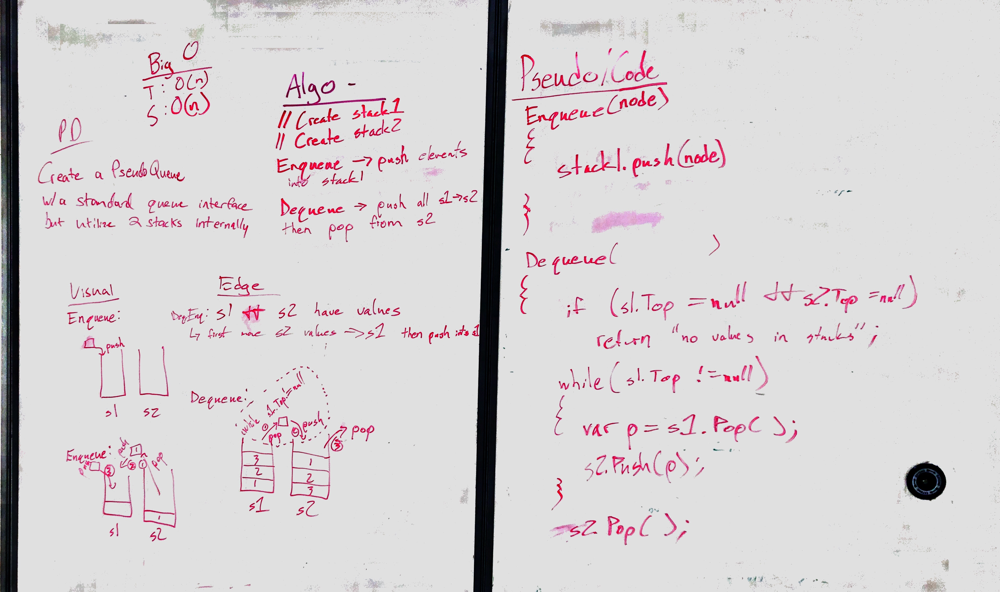

# Implement a Queue using two Stacks
<!-- Short summary or background information -->

## Challenge
<!-- Description of the challenge -->
Create a brand new `PseudoQueue` class. Do not use an existing Queue. Instead, this PseudoQueue class will implement the standard queue interface, but will internally only utilize 2 `Stack` objects. Ensure that you create your class with the following methods:

* `enqueue(value)` which inserts `value` into the `PseudoQueue`, using a first-in, first-out approach.
* `dequeue()` which extracts a value from the PseudoQueue, using a first-in, first-out approach.
* The `Stack` instances have only `push`, `pop`, and `peek` methods. You should use your own Stack implementation. Instantiate these Stack objects in your PseudoQueue constructor.

## Approach & Efficiency
<!-- What approach did you take? Why? What is the Big O space/time for this approach? -->
For this challenge, the approach was to use Enqueue() to add incoming values to stackOne. When Dequeue() is called, the contents of stackOne are popped and pushed into stackTwo. The Top of stackTwo is then returned. Subsequent Dequeue() calls result in a Pop() from stackTwo. If Enqueue() is called again before stackTwo is cleared, the contents of stackTwo are popped and pushed back into stackOne and the new value is added to the Top of stackOne.

#### BigO
Space O(1)/Time O(1)

## Solution
<!-- Embedded whiteboard image -->
