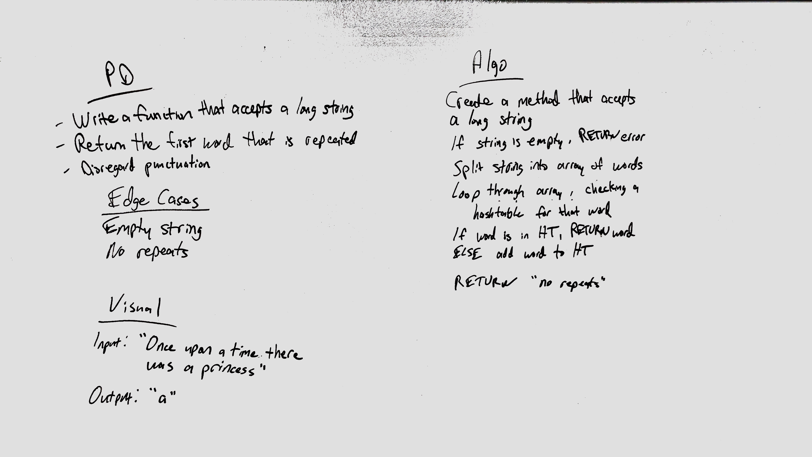

# First Repeated Word
<!-- Short summary or background information -->
Find the first repeated word in a book
## Challenge
<!-- Description of the challenge -->
* Write a function that accepts a lengthy string parameter.
* Without utilizing any of the built-in library methods available to your language, return the first word to occur more than once in that provided string.
## Approach & Efficiency
<!-- What approach did you take? Why? What is the Big O space/time for this approach? -->
For this challenge, a method was written that takes a string as input. The string is then broken into an array of words. This array is iterated through, and a hashtable is checked to see if it already contains that word. The first time a collision occurs, the current word is returned as the first repeated word. If no collisions occur, there are no repeats and "No repeated words" is returned by the method. If the input string is null, "String is null" is returned.

### Big O
Time: O(n)
Space: O(n)
## Solution
<!-- Embedded whiteboard image -->
