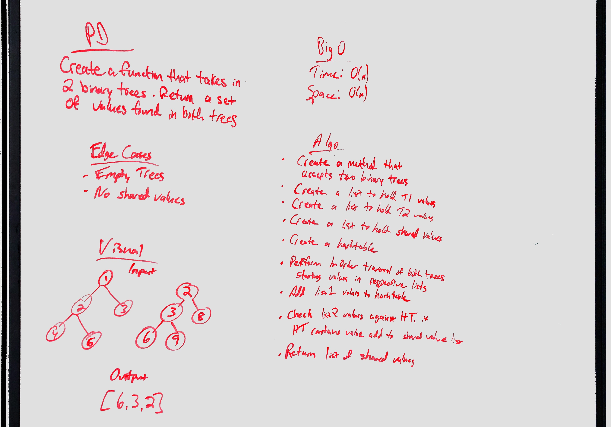

# Intersection of binary trees
<!-- Short summary or background information -->
Find common values in 2 binary trees

## Challenge
<!-- Description of the challenge -->
* Write a function called `tree_intersection` that takes two binary tree parameters.
* Without utilizing any of the built-in library methods available to your language, return a set of values found in both trees.

## Approach & Efficiency
<!-- What approach did you take? Why? What is the Big O space/time for this approach? -->
To approach this challenge, I first performed an InOrder traversal of both binary trees. This returns a list of the values in each tree. The values of one tree are then added to a hash table. The hash table is then checked to see if it contains the values of the second binary tree. If it does, the value is added to a list. The list of common values is then returned by the method.

### Big O
Time O(n)
Space O(n)

## Solution
<!-- Embedded whiteboard image -->
